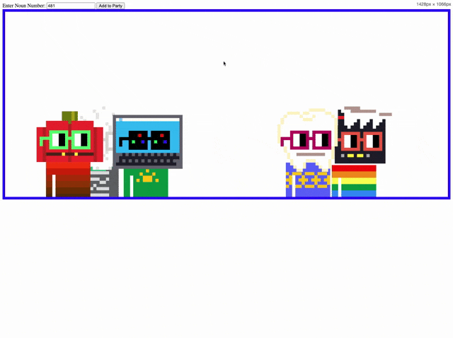

# Dancing Nouns

(Early recording, it has a tiny bit more style now.)

Hi.  I wanted to make nouns dance but the SVGs on chain don't have the art split into groups so I made a quick script that worked enough for a demo to allow you to select a Noun by Token ID and load them into a little dancing box.

## How To Use
- clone the repo to your machine (you'll need to be setup to run npm commands/node etc. )
- rename ``.env.sample`` to ``.env`` and update the infuria API Key with your own (there are free accounts.)
- install the required files with ``npm install``
- run ``npm start`` and it should run the server from http://localhost:3000
- navigate to http://localhost:3000 and enter in some of your favorite Noun Token Ids to invite them to the party

### Fun for Later
- [ ] Add blinking Eyelids
- [ ] Let them dance around horizontally more
- [ ] Responsive for all devices
- [ ] Add flashing lights and DJ Octo (from https://feeshes.com)
- [ ] fix any outliers of Nouns who maybe have clothing pieces get added to the head elements
- [ ] break out glasses and arms into their own groups for better dances

### License: Have fun and be kind.

xoxo

-Brock [@breadcat](https://warpcast.com/breadcat)